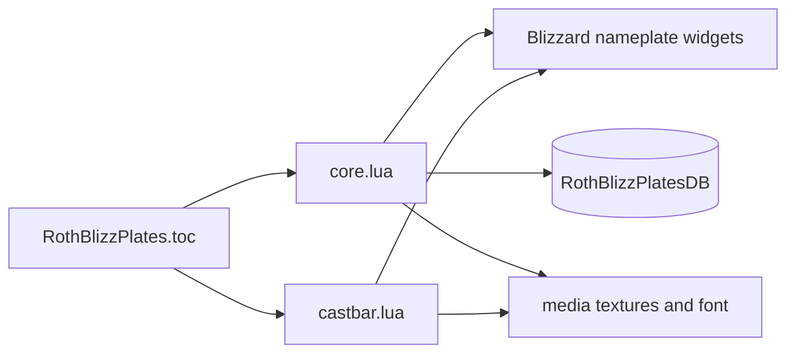

# Roth Blizzard Plates code graph

```mermaid
flowchart LR
  T["RothBlizzPlates.toc"] --> C["core.lua"]
  C --> N["Blizzard nameplate widgets"]
  C --> DB[("RothBlizzPlatesDB")]
  T --> B["castbar.lua"]
  B --> N
  C --> A["media textures and font"]
  B --> A
```
