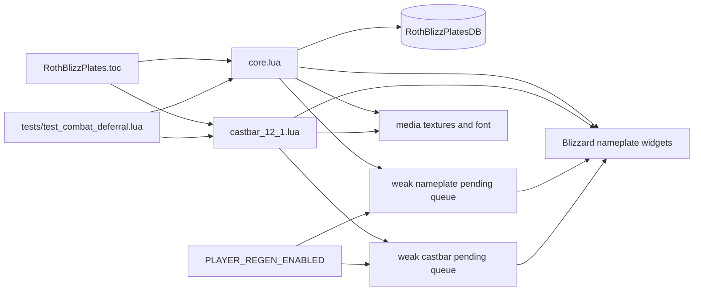

# Roth Blizzard Plates code graph

```mermaid
flowchart LR
  T["RothBlizzPlates.toc"] --> C["core.lua"]
  T --> B["castbar_12_1.lua"]
  C --> DB[("RothBlizzPlatesDB")]
  C --> N["Blizzard nameplate widgets"]
  B --> N
  C --> QN["weak nameplate pending queue"]
  B --> QB["weak castbar pending queue"]
  R["PLAYER_REGEN_ENABLED"] --> QN
  R --> QB
  QN --> N
  QB --> N
  C --> M["media textures and font"]
  B --> M
  X["tests/test_combat_deferral.lua"] --> C
  X --> B
```

Blizzard owns unit/cast state and lifecycle. The addon owns only additive presentation and out-of-combat retry state.
